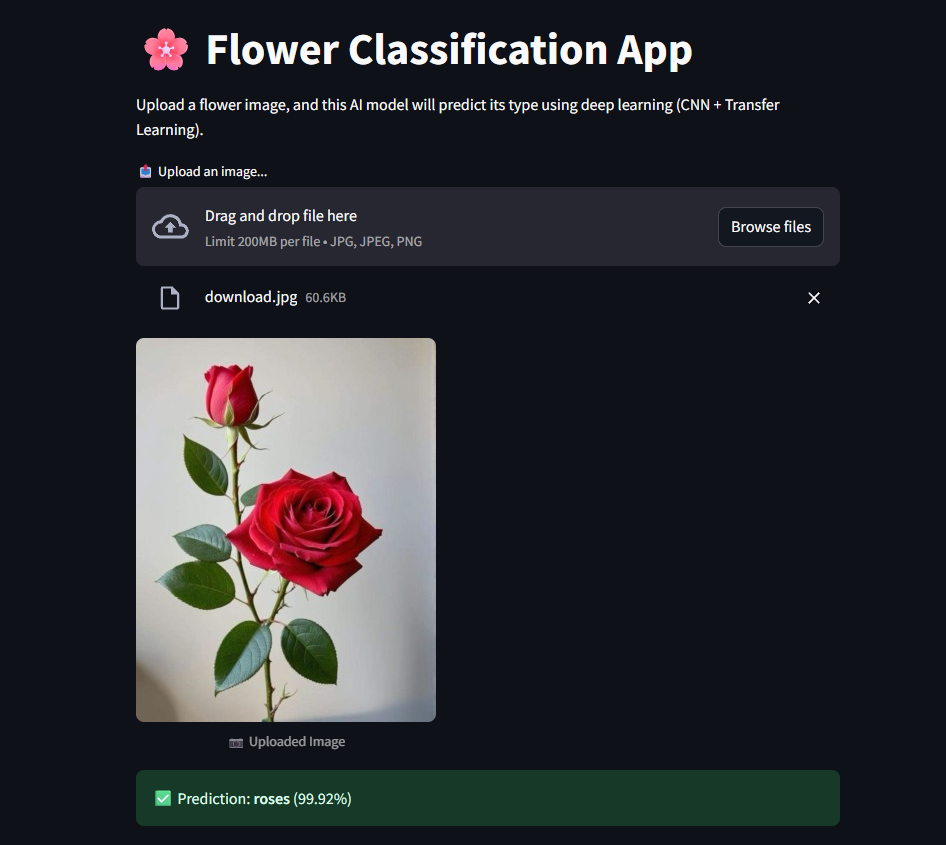
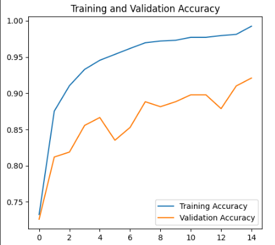
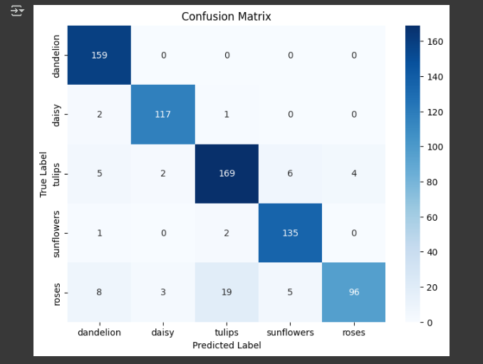

---

### 📄 `README.md` (Salin ke GitHub-mu)

````markdown
# 🧠 Image Classification with CNN – Fashion MNIST

Proyek ini bertujuan untuk membangun model klasifikasi gambar menggunakan Convolutional Neural Network (CNN) pada dataset **Fashion MNIST**, yang terdiri dari 70.000 gambar grayscale ukuran 28x28 piksel dari 10 kategori pakaian berbeda.

---

## 📚 Dataset

Dataset yang digunakan adalah [Fashion MNIST](https://github.com/zalandoresearch/fashion-mnist), yang tersedia langsung melalui TensorFlow/Keras API.

- 60.000 gambar untuk training
- 10.000 gambar untuk testing
- 10 Kelas: T-shirt/top, Trouser, Pullover, Dress, Coat, Sandal, Shirt, Sneaker, Bag, Ankle boot

---

## 🏗️ Model Arsitektur

Model CNN terdiri dari:

- 2 Convolutional Layers dengan ReLU activation
- MaxPooling dan Dropout
- Dense Layer dan Output Softmax

```python
model = Sequential([
    Conv2D(64, (3, 3), activation='relu', input_shape=(28, 28, 1)),
    MaxPooling2D((2, 2)),
    Conv2D(128, (3, 3), activation='relu'),
    MaxPooling2D((2, 2)),
    Dropout(0.25),
    Flatten(),
    Dense(128, activation='relu'),
    Dropout(0.5),
    Dense(10, activation='softmax')
])
````

---

## 📈 Hasil Evaluasi

* ✅ **Akurasi Testing**: \~90% (tergantung training)
* 📉 **Loss Function**: Sparse Categorical Crossentropy
* ⚙️ **Optimizer**: Adam

---

## 🔍 Visualisasi Hasil

### Contoh Prediksi

> Warna **Hijau** menunjukkan prediksi benar, **Merah** menunjukkan prediksi salah.

<p align="center">
  
</p>

---

### Grafik Akurasi dan Loss

<p align="center">
  
</p>

---

### Confusion Matrix

<p align="center">
  
</p>

---

## 🛠️ Tools & Library

* Python
* TensorFlow / Keras
* Matplotlib, Seaborn
* Scikit-learn

---

## 🚀 Cara Menjalankan

1. Jalankan semua cell di notebook Google Colab: [Klik di sini untuk membuka Colab](https://colab.research.google.com/)
2. Pastikan `tensorflow` dan `sklearn` sudah terinstal (di Colab sudah otomatis)
3. Semua gambar hasil visualisasi bisa disimpan menggunakan `plt.savefig()` jika ingin menambahkan ke dokumentasi.

---

## 📌 Insight

* Model ini bisa digunakan sebagai dasar untuk pengembangan sistem klasifikasi gambar berbasis AI.
* Cocok untuk portofolio, pembelajaran CNN, atau pengantar proyek Computer Vision.

---

## ✍️ Author

**Nama:** Ahmad SyahReza
**Role:** AI/ML Enthusiast

---

## 📂 Struktur Direktori

```
├── cnn_fashion_mnist.ipynb
├── README.md
└── screenshots/
    ├── sample_predictions.png
    ├── accuracy_loss.png
    └── confusion_matrix.png
```

---

## 📌 Catatan Tambahan

Model juga dapat disimpan dalam format `.h5` untuk keperluan deployment ke aplikasi web menggunakan Flask atau Streamlit:

```python
model.save('fashion_cnn_model.h5')
```

---

## 📃 Lisensi

Open source untuk keperluan pembelajaran dan riset pribadi.

```
